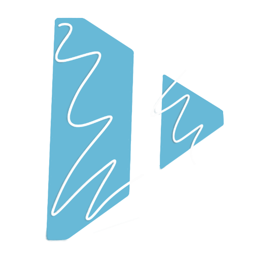

# Prodom  [](https://bundlephobia.com/result?p=prodom) [](https://www.npmjs.com/package/prodom) [](https://www.npmjs.com/package/prodom) [](https://badgen.net/npm/license/prodom)

<p align="center">
  
</p>

This is a declarative UI web framework.

## Live example

https://codepen.io/pen/?template=PoppQMM

## More information

https://m3ftah.github.io/prodom

## Example

```js
const prototype = {
  tag: 'div',
  textContent: 'Hello world',
};
render(prototype, {});
```

## License

MIT
